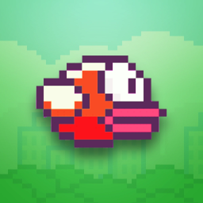
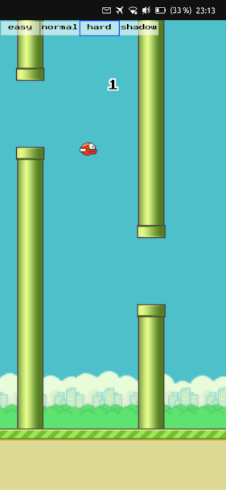

# Flappy Fish


Ubuntu Touch HTML5 game based on the work of [shuding](https://github.com/shuding/flappybird).

[](https://open-store.io/app/flappyfish.collaproductions)

### Building the app (Ubuntu-based distros)

Install [clickable](https://clickable-ut.dev/en/latest/install.html):

```
$ sudo add-apt-repository ppa:bhdouglass/clickable
$ sudo apt-get install clickable
```

Clone this repository and build:

```
$ git clone https://github.com/nicolascolla/flappyfish.git
$ cd flappyfish/flappyfish
$ clickable
```

You can play the game on any web browser by opening flappyfish/www/index.html.

### Known bugs

-The game starts with a "Game Over" screen instead of the usual "Get Ready!"

-Being an HTML5 app, it will tend to be slow on low-end devices (at least until the Ubuntu Touch webview is improved).

-The fish can get stuck jumping upwards until the game is restarted.

### Screenshots


